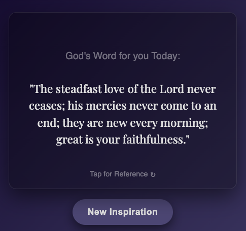

# DAILY DIVINE INSPIRATION APP 📿🙏🏽

> Your Daily Wisdom and Encouragement with a Beautifully Designed, Interactive Bible Verse App.

[](https://fntetteh.github.io/daily-bible-card/)

---

## 📸 Screenshots & Demos


---

## 🌟 About The Project

This project is a simple web application that provides users with a daily dose of inspiration through randomly selected Bible verses. Built with a focus on modern design and engaging user experience, it serves as a personal reflection tool and showcases robust front-end development skills.

My motivation behind building this was to create a serene and interactive digital space for daily spiritual nourishment, while simultaneously exploring advanced CSS techniques and dynamic JavaScript functionalities.

### 💡 Key Features

* **Dynamic Theming:** Automatically switches between a "Serene Dawn" (light) theme during the day and a "Deep Contemplation" (dark) theme at night, based on the user's local time.
* **Interactive Card Flip:** Users can click on the Bible verse card to seamlessly flip it over and reveal the corresponding scriptural reference.
* **"New Inspiration" Button:** A dedicated button allows users to fetch a new, random Bible verse instantly, accompanied by an elegant word-by-word text animation.
* **Glass morphism UI:** Features a modern, frosted-glass interface design, enhancing visual depth and appeal.
* **Subtle Background Animations:** Incorporates gentle, ambient particle effects in the background for an immersive and calming visual experience.
* **Responsive Design:** Fully optimized to provide a seamless and beautiful experience across all devices, from desktops to tablets to mobile phones.
* **Google Fonts Integration:** Utilizes custom typography from Google Fonts to ensure clear readability and a polished aesthetic.

### 🛠️ Built With

* **HTML5:** For semantic document structure.
* **CSS3:** Employing Custom Properties (CSS Variables) for dynamic theming, Flexbox and Grid for layout, advanced Animations (`@keyframes`, `transition`), `backdrop-filter` for glassmorphism, and `@media` queries with `clamp()` for responsive design.
* **JavaScript (Vanilla JS):** For DOM manipulation, event handling, dynamic content (verse loading), time-based logic, and orchestrating complex UI animations.
* **Git:** For version control.
* **GitHub:** For project hosting and collaboration.
* **Google Fonts:** For custom typography.

---

## 🚀 Getting Started

To get a local copy of the project up and running on your machine, follow these simple steps.

### Prerequisites

* A modern web browser (e.g., Google Chrome, Mozilla Firefox, Microsoft Edge, Safari)
* Git installed on your system (for cloning the repository)

### Installation & Local Setup

1.  **Clone the repository:**
    ```bash
    git clone [https://github.com/fntetteh/daily-bible-card.git](https://github.com/fntetteh/daily-bible-card.git)
    ```
    2.  **Navigate to the project directory:**
    ```bash
    cd daily-bible-card
    ```
3.  **Open the project in your browser:**
    Simply open the `index.html` file in your preferred web browser. You can drag and drop it into a browser tab, or right-click > "Open with..."

---

## 💡 Usage

The Daily Divine Inspiration App is designed for straightforward interaction:

* **Initial Load:** Upon loading, the app displays a random Bible verse with a theme (light or dark) automatically applied based on the current time of day.
* **Flip the Card:** Click anywhere on the verse card to reveal the corresponding Bible reference on the back. Click again to flip it back to the verse.
* **New Inspiration:** Click the "New Inspiration" button at the bottom to instantly load another random verse. The verse text will appear with a captivating word-by-word animation.

---

## 🌐 Deployment

This project is a static web application seamlessly deployed using **GitHub Pages**. It is publicly accessible and ready for viewing without any local setup required.

You can visit the live demo here: `https://fntetteh.github.io/daily-bible-card/`

---

## 🗺️ Roadmap

Here's a logical order of potential future enhancements for the project:

### Phase 1: Core UI/UX Refinements
* **More Dynamic & Animated UI:** Implement additional subtle animations for card elements, transitions, or background effects to enhance visual appeal.
* **Enhance "New Inspiration" Button Feedback:** Refine the button's visual and haptic feedback upon interaction.
* **Performance Optimization:** Analyze and optimize CSS and JavaScript for faster loading and smoother animations.

### Phase 2: User Customization & Data Management
* **User Customization:** Allow users to select preferred Bible translation versions.
* **Favorites/Bookmarks:** Implement a feature to save and retrieve favorite verses for quick access.

### Phase 3: Engagement & Content Expansion
* **Sharing Options:** Add buttons to easily share verses on social media or messaging apps.
* **Daily Notifications:** Explore browser-based notifications for a daily verse reminder (requires user permission).
* **Search Functionality:** Allow users to search for specific verses or topics within the verse collection.

---

## 📄 License

Distributed under the [MIT License](LICENSE). See `LICENSE` for more information.

---

Project Link: [https://github.com/fntetteh/daily-bible-card](https://github.com/fntetteh/daily-bible-card)

---
    
## 🙏 Acknowledgements

* Inspired by personal interest in spiritual reflection and modern web design.
* Utilizes the [Best-README-Template](https://github.com/othneildrew/Best-README-Template) by othneildrew for README structure.